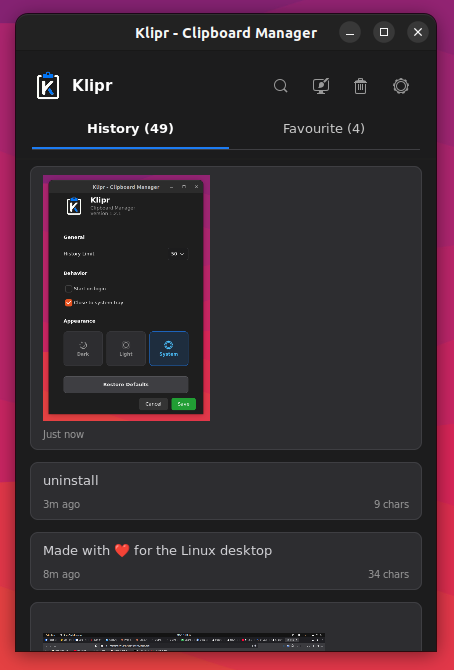
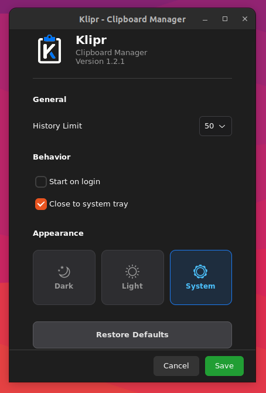

<p align="center">
  
</p>

<h1 align="center">Klipr</h1>

<p align="center">
  <b>A modern clipboard manager for Linux desktops</b><br/>
  Lightweight, fast, and built natively with GTK4
</p>

<p align="center">
  <a href="https://github.com/NguyenDuc2309/klipr/releases/latest"></a>
  
  
  
  <a href="LICENSE"></a>
</p>

<p align="center">
  <a href="#installation">Install</a>&nbsp;&nbsp;&bull;&nbsp;&nbsp;
  <a href="#features">Features</a>&nbsp;&nbsp;&bull;&nbsp;&nbsp;
  <a href="#screenshots">Screenshots</a>&nbsp;&nbsp;&bull;&nbsp;&nbsp;
  <a href="#configuration">Configuration</a>&nbsp;&nbsp;&bull;&nbsp;&nbsp;
  <a href="#building-from-source">Build</a>
</p>

---

## About

Klipr is a **clipboard history manager** that quietly runs in the background, saving everything you copy — text and images — so you never lose a copied snippet again. No Electron, no bloat — just a fast, minimal, and beautiful clipboard tool that integrates seamlessly with your Linux desktop.

---

## Screenshots

<p align="center">
  &nbsp;&nbsp;&nbsp;&nbsp;
  
</p>

---

## Features

| | Feature | Description |
|---|---|---|
| **Clipboard History** | Auto-capture | Saves every text and image you copy. Oldest items pruned automatically based on your history limit. |
| **Favorites** | Pin important clips | Pin frequently used snippets — favorites are never auto-deleted. |
| **Search** | Instant search | Real-time fuzzy search across history and favorites with IME support. |
| **Images** | Image support | Captures screenshots and copied graphics with inline thumbnails. One-click paste back. |
| **Themes** | Dark / Light / System | Follows your OS appearance or pick manually. |
| **Tray** | System tray integration | Runs silently in the tray. Always accessible, never in the way. |
| **Shortcut** | Global hotkey | Toggle Klipr from anywhere with a configurable shortcut (default: `Ctrl+Alt+M`). |
| **Autostart** | Launch on login | Starts hidden in the background, ready when you need it. |

---

## Installation

### Via APT (Ubuntu / Debian) — recommended

```bash
curl -fsSL https://nguyenduc2309.github.io/klipr/apt/klipr-archive-keyring.asc \
    | sudo gpg --dearmor -o /usr/share/keyrings/klipr-archive-keyring.gpg

echo "deb [signed-by=/usr/share/keyrings/klipr-archive-keyring.gpg] \
https://nguyenduc2309.github.io/klipr/apt stable main" \
    | sudo tee /etc/apt/sources.list.d/klipr.list

sudo apt update
sudo apt install klipr
```

Future releases arrive through `sudo apt upgrade` like any other package.
See [PUBLISH.md](PUBLISH.md) for how the repo itself is built and signed.

### From a downloaded `.deb`

Download the latest `.deb` from [Releases](https://github.com/NguyenDuc2309/klipr/releases/latest), then:

```bash
sudo apt install ./klipr_1.2.4_all.deb
```

### Building from source

```bash
git clone https://github.com/NguyenDuc2309/klipr.git
cd klipr
python3 -m venv .venv
source .venv/bin/activate
pip install -r requirements.txt
python3 src/main.py
```

**Runtime dependencies:** `python3`, `python3-gi`, `python3-gi-cairo`, `gir1.2-gtk-4.0`, `python3-pil`

---

## Configuration

Settings are accessible from the gear icon in the app, or edit `~/.config/klipr/setting.json` directly.

| Setting | Default | Description |
|---|---|---|
| `historyLimit` | `50` | Max clipboard items to keep |
| `theme` | `system` | `dark`, `light`, or `system` |
| `closeToTray` | `true` | Minimize to tray instead of quitting |
| `autostart` | `true` | Start on login |
| `shortcut` | `Ctrl+Alt+M` | Global shortcut to toggle window |

---

## Tech Stack

- **Language:** Python 3
- **UI Framework:** GTK4 (via PyGObject)
- **Database:** SQLite
- **Tray:** D-Bus StatusNotifierItem (no AppIndicator dependency)
- **Platform:** Linux (X11)

---

## License

[MIT License](LICENSE)

---

## Author

**Nguyen Duc** — [@NguyenDuc2309](https://github.com/NguyenDuc2309)

---

<p align="center">
  Made with ❤️ for the Linux desktop
</p>
