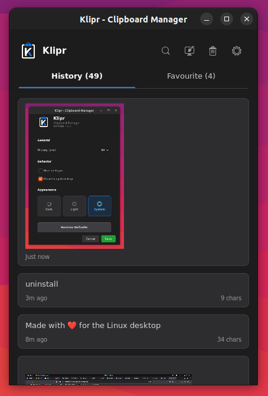
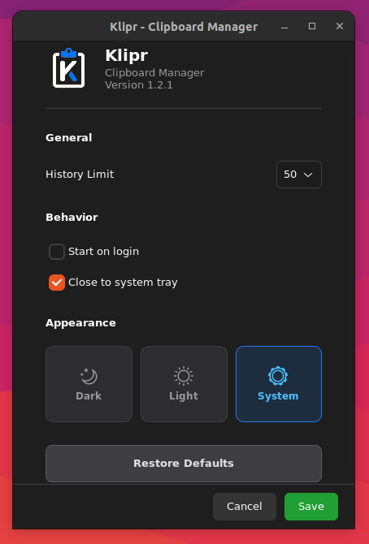

<p align="center">
  
</p>

<h1 align="center">Klipr</h1>

<p align="center">
  <b>A modern clipboard manager for Linux desktops</b><br/>
  Lightweight, fast, and built natively with GTK4
</p>

<p align="center">
  <b>English</b> · <a href="README.vi.md">Tiếng Việt</a>
</p>

<p align="center">
  <a href="https://github.com/NguyenDuc2309/klipr/releases/latest"></a>
  <a href="https://github.com/NguyenDuc2309/klipr/actions/workflows/ci.yml"></a>
  
  
  
  <a href="LICENSE"></a>
</p>

<p align="center">
  <a href="#installation">Install</a> •
  <a href="#features">Features</a> •
  <a href="#usage">Usage</a> •
  <a href="#configuration">Configuration</a> •
  <a href="#desktop-support">Desktop support</a> •
  <a href="CONTRIBUTING.md">Contributing</a>
</p>

---

Klipr quietly runs in the background and saves everything you copy, text and images, so you never lose a snippet
again. No Electron, no bloat: a small native GTK4 app that fits into your desktop.

<p align="center">
  &nbsp;&nbsp;&nbsp;&nbsp;
  
</p>

## Features

| Feature | Description |
|---|---|
| **Clipboard history** | Saves every text and image you copy. Oldest items are pruned by your history limit. |
| **Favorites** | Pin snippets you reuse. Favorites are never auto-deleted. |
| **Search** | Instant search across history and favorites, works with input methods such as Vietnamese IME. |
| **Images** | Screenshots and copied graphics with inline thumbnails, one click to copy back. |
| **Image to text (AI OCR)** | Extract text from an image item with Gemini or any OpenAI-compatible API (your own key). |
| **Themes** | Dark, light, or follow the system. |
| **Tray** | Lives in the system tray, out of the way. |
| **Global shortcut** | Toggle Klipr from anywhere, default `Ctrl+Alt+M`. |
| **Autostart** | Starts hidden on login. |

## Installation

Requires Ubuntu 22.04+ / Debian 12+ or another distro with GTK 4 and Python 3.10+.

### APT repository (Ubuntu / Debian), recommended

Updates arrive with `sudo apt upgrade`.

```bash
curl -fsSL https://nguyenduc2309.github.io/klipr/apt/klipr-archive-keyring.asc \
    | sudo gpg --dearmor -o /usr/share/keyrings/klipr-archive-keyring.gpg

echo "deb [signed-by=/usr/share/keyrings/klipr-archive-keyring.gpg] \
https://nguyenduc2309.github.io/klipr/apt stable main" \
    | sudo tee /etc/apt/sources.list.d/klipr.list

sudo apt update
sudo apt install klipr
```

### Snap

```bash
sudo snap install klipr
```

### `.deb` from GitHub Releases

Download `klipr_<version>_all.deb` from [Releases](https://github.com/NguyenDuc2309/klipr/releases/latest)
(`all` means one package for every CPU, since Klipr is pure Python), then:

```bash
sudo apt install ./klipr_*_all.deb
```

Each release also has a `SHA256SUMS` file: `sha256sum -c SHA256SUMS --ignore-missing`.

### Run from source

See [CONTRIBUTING.md](CONTRIBUTING.md#development-setup).

### Uninstall

```bash
sudo apt remove klipr        # or: sudo snap remove klipr
```

Your history and settings are kept. To remove them too:
`rm -rf ~/.local/share/klipr ~/.cache/klipr ~/.config/klipr ~/.config/autostart/klipr.desktop`

## Usage

| Action | How |
|---|---|
| Open / hide | `Ctrl+Alt+M`, click the tray icon, or run `klipr` |
| Copy an item back | Click the item or its copy button. It goes back to the clipboard, ready to paste. |
| Search | `Ctrl+F` |
| Add to favorites | Favorite button on the item |
| Extract text from an image | Text button on an image item (needs an API key in Settings). The text is copied to the clipboard. |
| Quit completely | Tray icon → **Quit** |

Command line: `klipr --hidden` starts in the background, `klipr --toggle` shows or hides the window.

## Configuration

Use the gear icon in the app, or edit `~/.config/klipr/setting.json`.

| Setting | Default | Description |
|---|---|---|
| `historyLimit` | `50` | Max history items to keep |
| `theme` | `system` | `dark`, `light` or `system` |
| `closeToTray` | `true` | Closing the window hides it instead of quitting |
| `autostart` | `true` | Start hidden on login |
| `shortcut` | `Ctrl+Alt+M` | Global shortcut to toggle the window |
| `ocrProvider` | `gemini` | `gemini` or `openai` |
| `ocrGeminiKey` / `ocrGeminiModel` | `""` / `gemini-3.1-flash-lite` | Gemini API key and model |
| `ocrOpenAIKey` / `ocrOpenAIModel` | `""` / `gpt-4o-mini` | OpenAI key and model |
| `ocrOpenAIBaseUrl` | `https://api.openai.com/v1` | Any OpenAI-compatible endpoint |
| `ocrNotifyOnExtract` | `true` | Desktop notification when extraction finishes |

> **Privacy:** Klipr stores history locally and never sends it anywhere. An image is only uploaded to your
> configured AI provider when you click extract. API keys are stored **in plain text** in the settings file.

## Desktop support

| | Status |
|---|---|
| GNOME on X11 | ✅ Full support |
| GNOME on Wayland | ✅ Runs through XWayland (Klipr forces the X11 backend) |
| KDE Plasma | ✅ App and tray work. The global shortcut is only auto-registered on GNOME: bind `klipr --toggle` in KDE's shortcut settings. |
| Xfce, Cinnamon, others | ✅ App works. Tray needs a StatusNotifierItem host. The global shortcut is only auto-registered on GNOME: bind `klipr --toggle` in your desktop's keyboard settings. |
| Tray on GNOME | Needs the AppIndicator extension (preinstalled on Ubuntu) |

Having trouble? See [troubleshooting](docs/architecture.md#troubleshooting) or
[open an issue](https://github.com/NguyenDuc2309/klipr/issues).

## Contributing

Bug reports, fixes and features are welcome. Start with [CONTRIBUTING.md](CONTRIBUTING.md).
How it works inside: [docs/architecture.md](docs/architecture.md).

## License

[MIT](LICENSE) © [Nguyen Duc](https://github.com/NguyenDuc2309)
